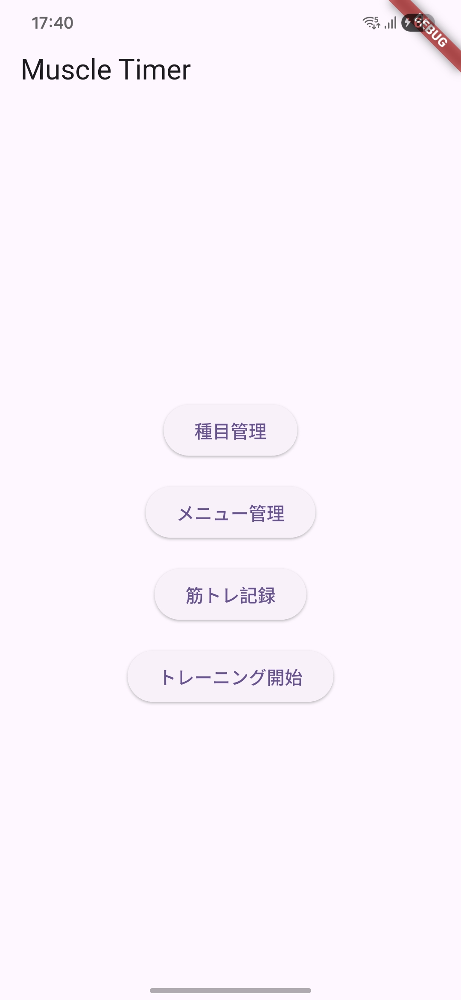
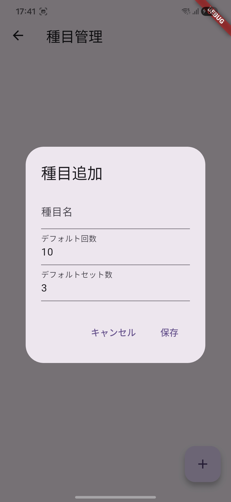
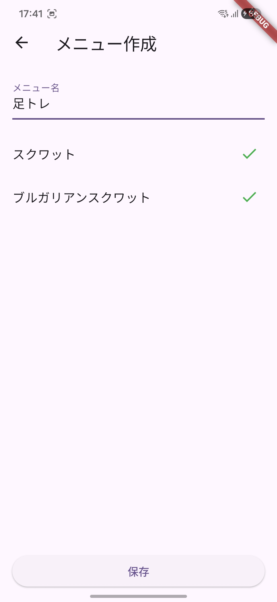
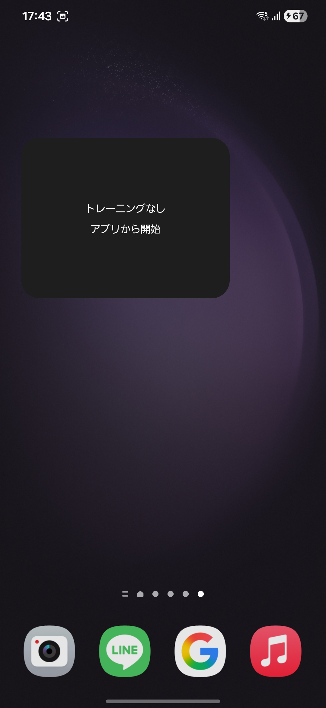
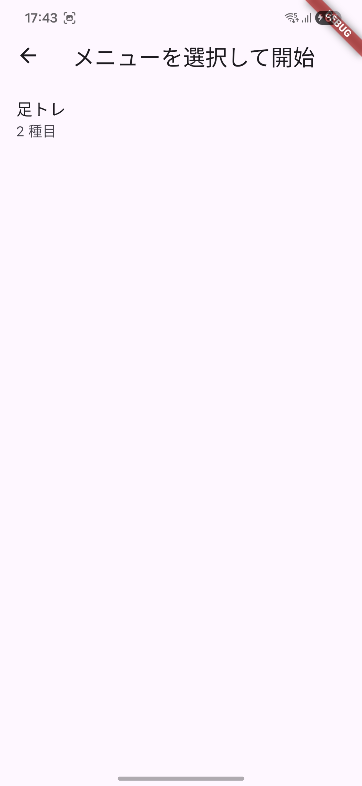
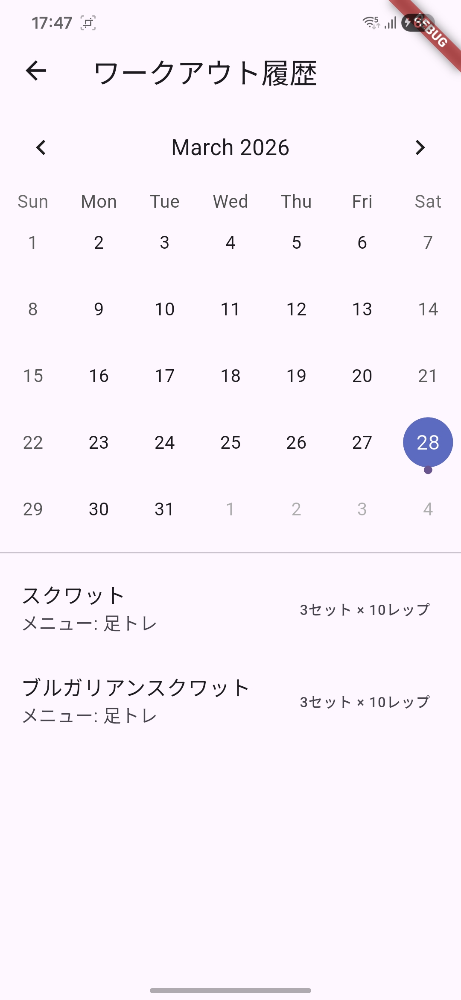

# refactor_me

筋トレ記録をつけて、モチベーションを維持しましょう。

## トップ画面

【種目管理】
- 筋トレの種目を作成します。 
例）腕立て、スクワット等

【メニュー管理】
- 作成した種目を選択して、メニューを作成します。

【筋トレ記録】
- トレーニングの記録を閲覧できます。
「トレーニング開始」からセット完了することで記録されます

【トレーニング開始】
- メニューを選択して、トレーニングを開始できます

## 筋トレ種目の追加

まずは種目を追加！

## メニュー管理

種目を元にお好みのメニューを作成！

## ホーム画面にウィジェットを設置

## トレーニング開始

<video src="https://github.com/user-attachments/assets/9bf1f5d4-06ee-4370-aa68-3341904f7e06" width="80%" controls></video>

## カレンダー

